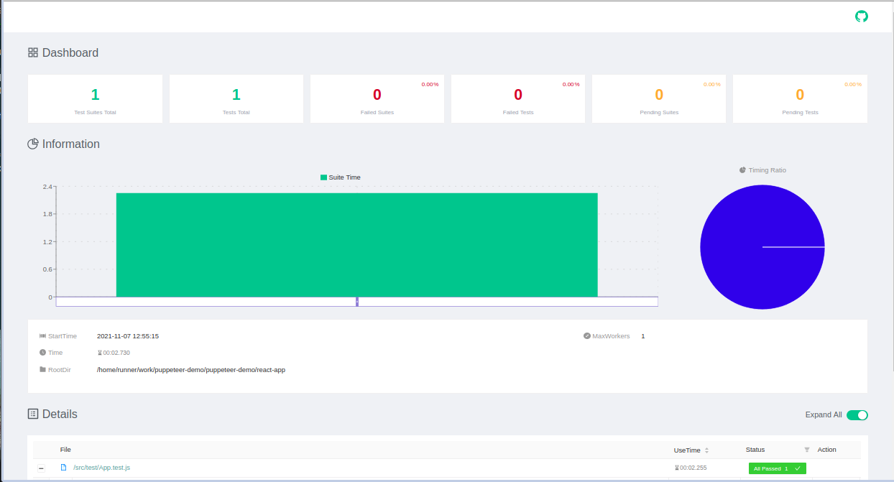

# Puppeteer-demo

Project for testing with CI on Github actions and publish a report on GitHub pages
This react-app project deploy on [Netlify page](https://zen-hamilton-cd006e.netlify.app/).

## To get report
If you create PR or push your code in `main` branch will start Github actions for running react-app on remotly Ubuntu on `localhost:3000` and running puppeteer tests. In the end of the process test-report publish and you can look at the new report on [github pages](https://farvater-max.github.io/puppeteer-demo/) in this repo

## Available Scripts for react-app to local development

In the project directory `react-app`, you can run:

### `npm run start`

Runs the app in the development mode.\
Open [http://localhost:3000](http://localhost:3000) to view it in the browser.

The page will reload if you make edits.\
You will also see any lint errors in the console.

### `npm run test`

Launches the test runner in the interactive watch mode.\

### `npm run dev`

Unites command `npm run start` and `npm run test` for local app testing. This command using package `start-server-and-test` for start and run test project by one command.

### `npm run build`

Builds the app for production to the `build` folder.\
It correctly bundles React in production mode and optimizes the build for the best performance.
